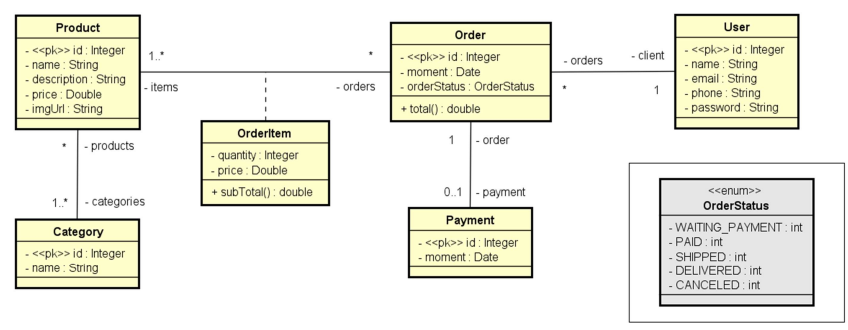

# Web Services com Spring Boot e JPA

Projeto desenvolvido durante os estudos de Java Backend com o objetivo de aplicar os principais conceitos de desenvolvimento de APIs REST utilizando Spring Boot, JPA/Hibernate e banco de dados relacional.

O sistema simula um pequeno e-commerce, permitindo o gerenciamento de usuários, pedidos, produtos, categorias, pagamentos e itens de pedidos, explorando diferentes tipos de relacionamentos entre entidades.

## Tecnologias utilizadas

- Java
- Spring Boot
- Spring Data JPA
- Hibernate
- Maven
- Banco H2
- REST API

## Conceitos aplicados

Durante o desenvolvimento foram utilizados conceitos importantes do ecossistema Spring:

- Arquitetura em camadas
- API REST
- CRUD
- Spring Boot
- Spring Data JPA
- Hibernate
- Injeção de Dependência
- Tratamento de Exceções
- Relacionamentos entre entidades
- Banco H2 para desenvolvimento

## Modelo de domínio

A aplicação foi desenvolvida utilizando uma arquitetura baseada em entidades JPA. O diagrama abaixo representa o relacionamento entre as principais entidades do sistema.

  

## Objetivo do projeto

Este projeto foi desenvolvido com foco em aprendizado, praticando os principais recursos utilizados no desenvolvimento de aplicações backend com Spring Boot e JPA.

## Autor

Rian Sousa

GitHub:
https://github.com/riansousa1